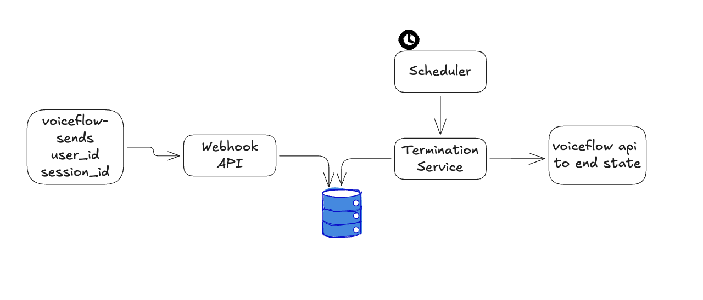
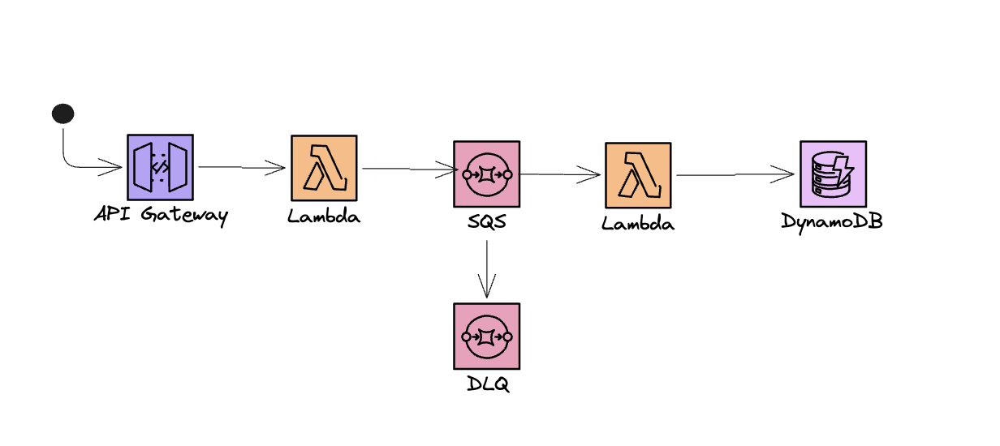
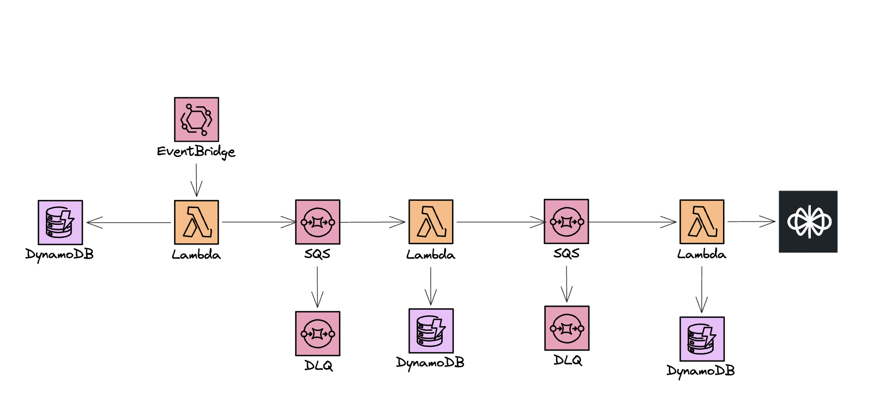

# Voiceflow Auto End Chat - Serverless

A serverless AWS pipeline that automatically ends inactive Voiceflow chat sessions. It solves the problem of zombie sessions persisting in Voiceflow when users abandon a conversation without explicitly ending it. Built as an event-driven system using API Gateway, SQS, Lambda, and DynamoDB, ensuring sessions are cleaned up reliably and at scale without manual intervention.

---

## Screenshot

At a high level, a request originates inside Voiceflow and is sent to our webhook via API Gateway, triggering a session activity event. From there, the system checks whether that session has expired based on an arbitrary 10-minute inactivity window. If it has, the Voiceflow API is called to programmatically end the session state.

****


This is the first part of the workflow:

- Voiceflow sends a POST request to API Gateway
- API Gateway forwards the request to a Lambda function that transforms, checks, and validates the data
- That Lambda enqueues the event onto an SQS queue, which acts as a buffering layer paired with a dead-letter queue to capture any problematic events
- A worker Lambda consumes the SQS message and stores the event in DynamoDB

****


This is the second part of the workflow:

- An EventBridge scheduler triggers every 2 minutes to check whether any session has been inactive beyond the prescribed window (10 minutes by default)
- A Lambda function queries the DynamoDB table for all expired session records
- Those records are forwarded to another Lambda, which marks a field on each row as expired so the scheduler no longer picks them up
- The expired sessions are then passed to a separate SQS queue, which feeds a downstream Lambda responsible for calling the Voiceflow API to end the session for that user

The reason the Voiceflow API call and the DynamoDB update are handled by separate Lambdas is intentional. Calling an external API introduces failure modes — rate limits, regional quotas, network errors, third-party throttling — that are independent of our internal state update. By decoupling the two, we can continuously retry the Voiceflow API call without it affecting the database write that marks the session as inactive and expired.

****

---

## Core Functionality

- Receives chat events via a private HTTP endpoint and enqueues them for processing
- Tracks per-user session activity in DynamoDB with a scheduled end timestamp
- Runs a scheduled job every 2 minutes to detect and flag expired sessions
- Marks expired sessions inactive and forwards them to a notification queue
- Calls the Voiceflow Dialog Management API to programmatically end the session

---

## Tech Stack

| Layer        | Technology                              |
| ------------ | --------------------------------------- |
| Runtime      | Node.js 20.x (ARM64)                    |
| Language     | TypeScript                              |
| Framework    | Serverless Framework v4                 |
| Cloud        | AWS (Lambda, API Gateway, SQS, DynamoDB)|
| Build        | esbuild                                 |
| Validation   | Zod                                     |
| Date Handling| Luxon                                   |

---

## Deployment

**Prerequisites:** AWS CLI configured, Serverless Framework v4 installed, `.env` populated (see [Environment Variables](#environment-variables)).

```bash
# Install dependencies
npm install

# Deploy to dev
npm run deploy

# Deploy to a specific stage/region
serverless deploy --stage prod --region us-east-1
```

---

## Endpoints

| Method | Path    | Auth        | Description                            |
| ------ | ------- | ----------- | -------------------------------------- |
| `POST` | `/chat` | API Key     | Submit a chat event for processing     |

**Request body:**

```json
{
  "userId": "string",
  "sessionId": "string"
}
```

The API key must be passed via the `x-api-key` header. This key matches the webhook secret configured in Voiceflow settings.

---

## Environment Variables

Copy `.env.example` to `.env` and fill in the values.

| Variable               | Required | Description                                                         |
| ---------------------- | -------- | ------------------------------------------------------------------- |
| `AWS_HTTP_API_KEY`     | Yes      | API Gateway key (must match the webhook secret in Voiceflow)        |
| `VOICEFLOW_API_KEY`    | Yes      | Voiceflow API key for the Dialog Management API                     |
| `VOICEFLOW_BASEURL`    | Yes      | Voiceflow runtime base URL (default: `https://general-runtime.voiceflow.com`) |
| `VOICEFLOW_VERSIONID`  | No       | Voiceflow environment to target (default: `development`)            |

---

## Project Structure

```
.
├── src/
│   ├── functions/
│   │   ├── submit-chat-event.ts        # POST /chat handler, enqueues event to SQS
│   │   ├── process-chat-event.ts       # SQS consumer, upserts session in DynamoDB
│   │   ├── determine-session.ts        # Scheduled, queries & flags expired sessions
│   │   ├── mark-sessions-inactive.ts   # SQS consumer, marks sessions inactive
│   │   └── notify-external-service.ts  # SQS consumer, calls Voiceflow to end session
│   ├── modules/
│   │   └── voiceflow/
│   │       └── voiceflow-service.ts    # Voiceflow Dialog Management API client
│   ├── models/
│   │   └── data.ts                     # Shared data models
│   └── util/
│       ├── config.ts                   # Environment variable config
│       └── date.ts                     # Date/time utilities
├── resources.yml                       # CloudFormation resource definitions
├── serverless.yml                      # Serverless Framework config
├── .env.example                        # Environment variable template
└── package.json
```

---

## Contributing

1. Fork the repository
2. Create a feature branch (`git checkout -b feature/my-change`)
3. Commit your changes (`git commit -m 'feat: add my change'`)
4. Push and open a Pull Request

Please keep changes focused and include a clear description of the problem being solved.

---

## License

MIT - see [LICENSE](LICENSE) for details.

---

## Author

**Andrew Pettigrew**
[GitHub](https://github.com/andrewpettigrew)
